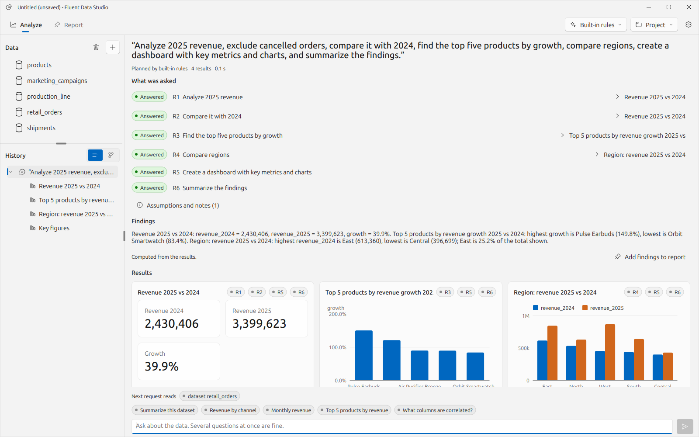
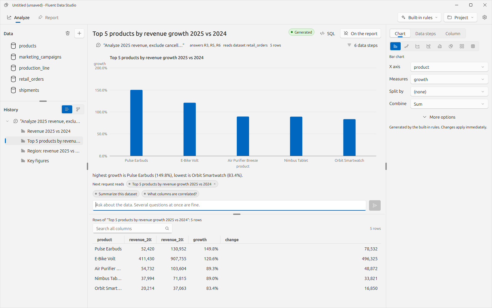
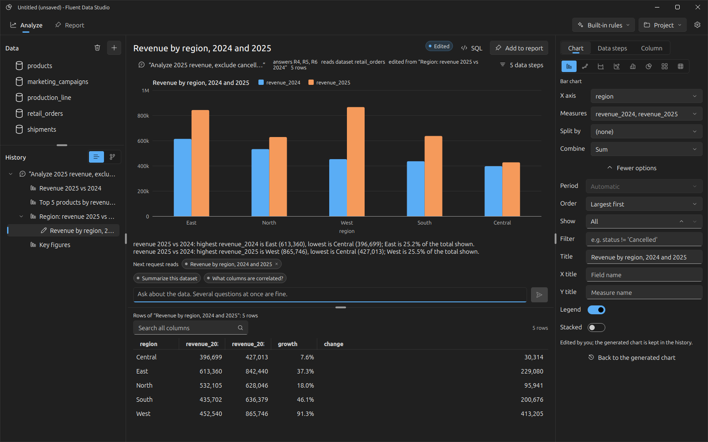
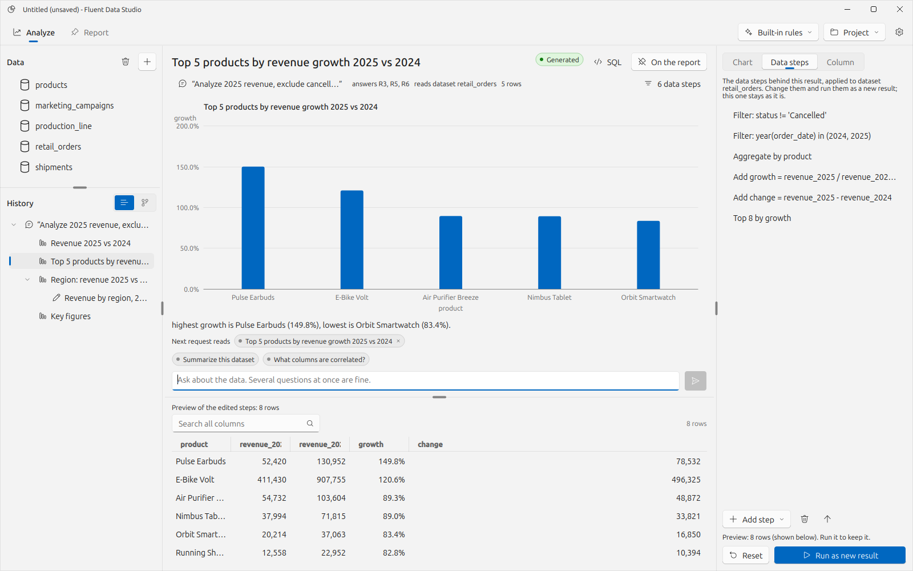
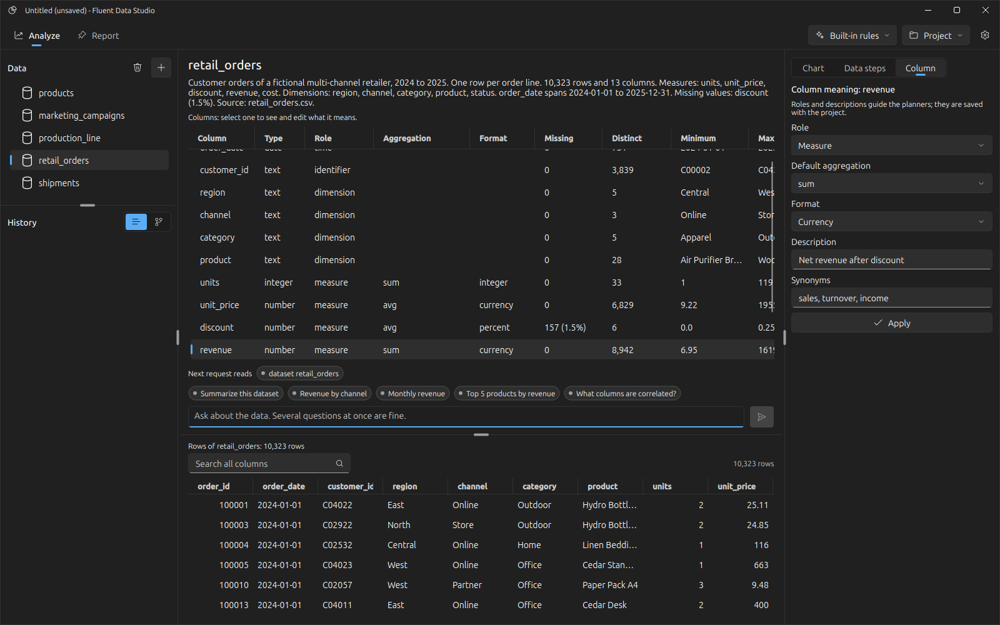
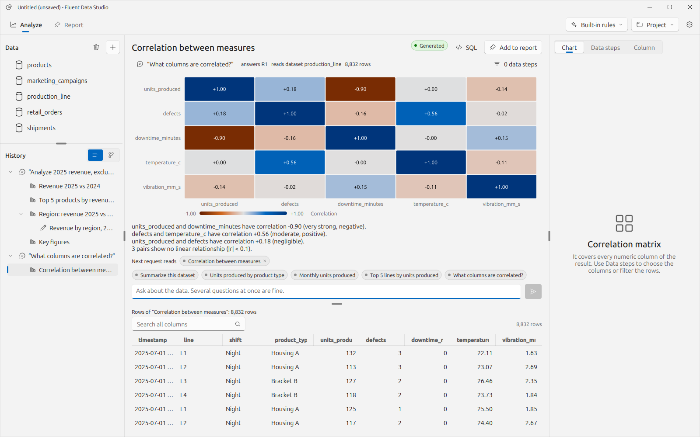
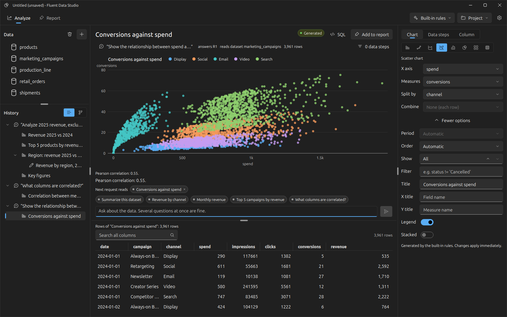
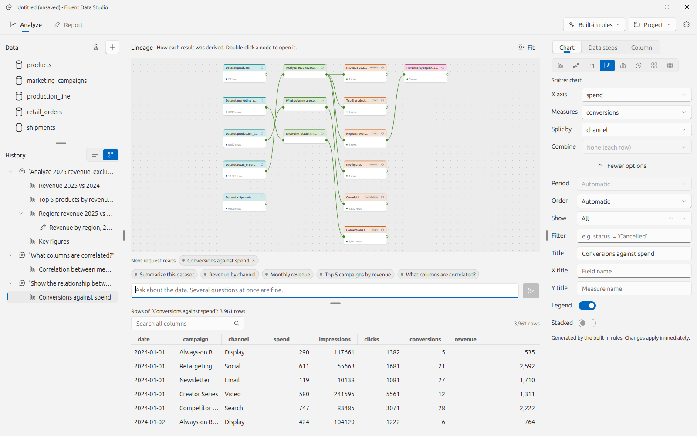
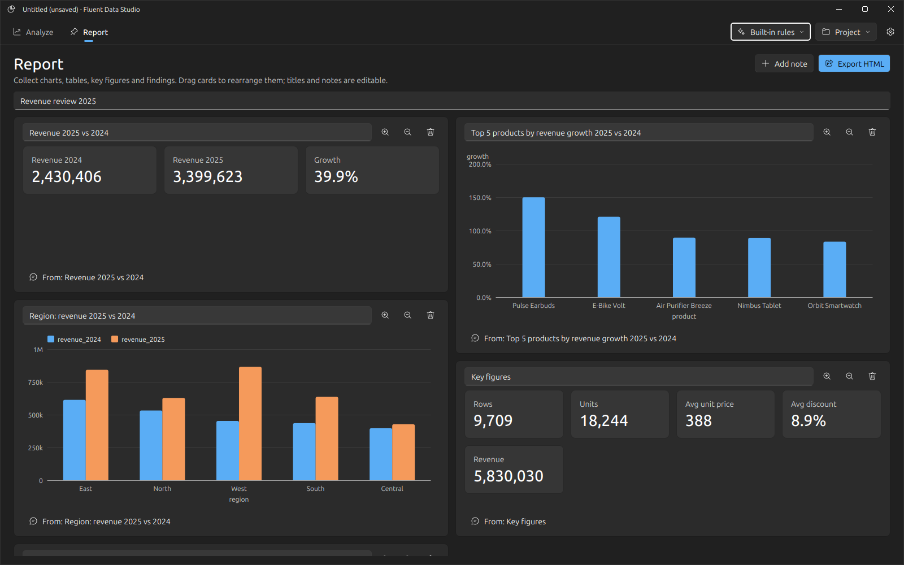
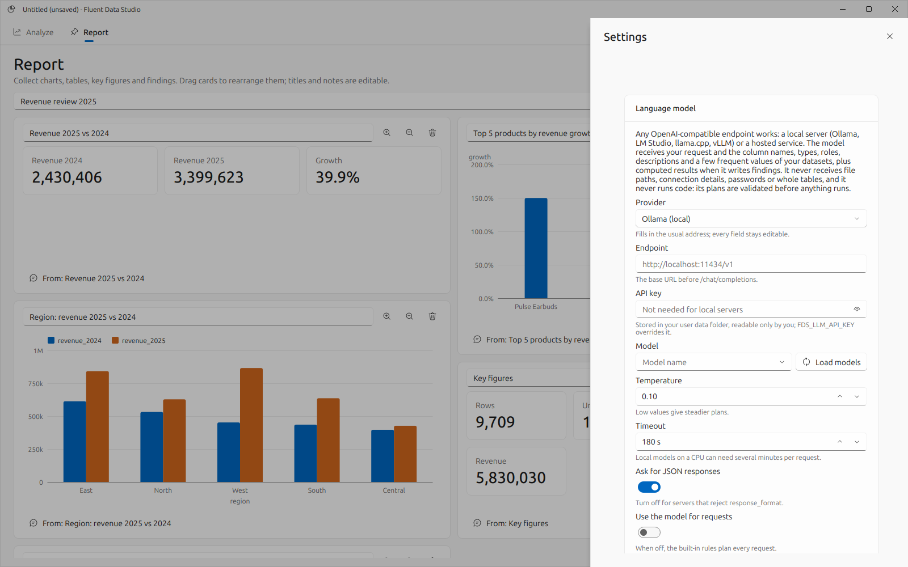

# Fluent Data Studio

**AI-powered data analysis and visualization workspace built with FluentQt Community + FluentQt Pro.**

<picture>
  <source media="(prefers-color-scheme: dark)" srcset="docs/images/02-request-overview-dark.png">
  
</picture>

Fluent Data Studio is a desktop workspace for asking questions of data in plain language and getting answers you can
check. You connect files, databases or web APIs, look at rows and column profiles, and ask for what you need, several
things at once if you like. The request is split into requirements and planned as a series of typed data operations.
Each plan is validated against the real tables before it runs. Every result shows which requirement it answers, which
operations produced it and the SQL behind it. Charts are structured specs you can edit without asking again. Every step
stays in a branching history, and the results you want to keep go onto a report.

It is an independent 2026 portfolio project. Its product direction (natural-language analysis, analysis threads,
reports) was informed by Microsoft Research's [Data Formulator](https://github.com/microsoft/data-formulator). The
code, interface, architecture and data are original work. It is not affiliated with or endorsed by Microsoft.

## This repository

This is the public presentation of Fluent Data Studio: what it does, how it is designed, and screenshots of the
running application. The source code is private at this stage; the application is built on FluentQt Community and
FluentQt Pro, which are not publicly available either.

## What it does

Everything happens in one **Analyze** workspace, with a **Report** next to it:

<picture>
  <source media="(prefers-color-scheme: dark)" srcset="docs/images/03-result-dark.png">
  
</picture>

- **Left:** the datasets, and the analysis history as a tree. The history can switch to a lineage graph of how each
  result was derived.
- **Centre:** whatever is selected. A dataset shows its profile, a request shows what was understood, and a result
  shows its chart, where it came from and what it shows. The request box sits underneath and always says what the next
  request will read.
- **Right:** the inspector, with the chart's encodings, the data steps behind the result, or a column's meaning.
- **Bottom:** the rows of the selection, or a preview of edited steps.

**Connect.** CSV and TSV, JSON and JSON Lines, Parquet and Excel files; SQLite and DuckDB databases; PostgreSQL;
CSV, JSON or Parquet from a web address, including JSON REST endpoints with nested records and a bearer token. Every
source is read-only and copied into a local DuckDB workspace up to a row limit. Passwords and tokens stay in memory.

**Understand.** Selecting a dataset shows its description, profile facts, a column table (type, role, missing,
distinct, range, frequent values) and its rows. A small semantic layer gives each column a role (dimension, measure,
time, identifier), a default aggregation, a display format, a description and synonyms. Roles are inferred, can ship
with a dataset in a sidecar file, and can be corrected in the inspector. The planners reason with this meaning, not
just the column names.

**Ask.** A request such as *"Analyze 2025 revenue, exclude cancelled orders, compare it with 2024, find the top five
products by growth, compare regions, create a dashboard with key metrics and charts, and summarize the findings"*
becomes six requirements. Constraints like the year and the exclusion apply to every step they concern. The request
overview lists each requirement as answered, failed or not covered, links it to the results that answer it, and
shows every result as a tile. Words the rule planner could not use are listed instead of being guessed at.

**Inspect.** A result shows the request it answers, the input it read, its requirement ids, its rows, the generated
SQL, and the facts derived from it. Findings either quote those facts or are written by the model from them; figures
the model writes that are not in the results are flagged.

**Refine.** The inspector edits the chart beside it. Type, x, measures, split and aggregation are always visible;
period, order, limit, filter, titles, legend and stacking are one click away. Edits apply at once and become one
refinement in the history, labelled *Edited*; the generated chart is kept and one click away. The *Data steps* tab
shows the operations behind any result, generated or not. Change them, preview the rows, and run them as a new
branch. Misleading chart choices (a pie of averages, a line through unordered categories, sixty bars) are corrected
with a reason.

**Branch.** Selecting any result makes it the context of the next request. Selecting a dataset starts afresh. The
planner sees the results along the selected branch.

**Report.** "Add to report" keeps a result on a responsive grid you rearrange by dragging. Titles and notes are
editable, cards can be widened, and each card links back to the result that produced it. A card offers the edited
version when its result was refined later. The report exports to a self-contained HTML file, and a request for a
dashboard fills it automatically.

**Without a model.** Loading, profiling, browsing, preparing data, charting and reporting need no model. A built-in
rule planner handles common requests ("revenue by region in 2025", "top 5 products by units", "monthly sales",
"relationship between price and units", "unusual values", "what is correlated") with the same plans, validation and
history. The model menu in the top bar shows which planner will run.

## Screenshots

| | |
|---|---|
|  | **A compound request.** Six requirements, each answered and linked to its result; findings; one tile per result. |
|  | **Chart editing.** Encodings beside the chart; the edit is a refinement and the generated chart is kept. |
|  | **Data steps.** The operations behind a generated result, edited with a live preview of the rows. |
|  | **A dataset.** Description, profile, columns and their meaning, rows. |
|  | **Correlation.** "What columns are correlated?" on the production data. |
|  | **Relationships.** Spend against conversions by channel, sampled honestly, with the correlation. |
|  | **Lineage.** The same history as a node graph of what each result was derived from. |
|  | **Report.** Key figures and charts on a dashboard grid, each linked to its analysis. |
|  | **Settings.** Any OpenAI-compatible endpoint, local or hosted, and what the model is allowed to see. |

## How a request is handled

1. **Context.** The planner receives the request and a description of the data: dataset and column names, types,
   roles, descriptions, synonyms, ranges and a few frequent category values, plus the results on the current branch.
   It never receives file paths, hosts, user names, passwords or tables of rows.
2. **Plan.** The model (or the rule planner) returns a JSON plan: requirements, assumptions and steps. Each step names
   its input (a dataset or an earlier step), a list of operations, how to show the result and which requirements it
   covers. Models never write SQL or Python.
3. **Validate.** Every operation is checked against the columns it receives. Conditions and formulas are parsed by a
   small expression language, and every stage is bound by DuckDB without running. Unknown columns, wrong types,
   chart fields missing from a result and uncovered requirements are sent back to the model with exact messages, at
   most twice. If the plan is still invalid, the rule planner takes over and the run says so.
4. **Run.** Steps compile to one SQL query each, run on a worker thread and store their results as tables, so later
   steps and follow-up requests can build on them.
5. **Findings.** Facts are computed from each result: extremes, shares of the total, change over time, peaks,
   correlations, outlier counts. A model may phrase them; it does not compute them.

More detail: [interface decisions](docs/ux-decisions.md), [data sources and safety](docs/data-sources.md), [decisions and limitations](docs/decisions.md).

## Data sources

| Source | Status | Notes |
|---|---|---|
| CSV, TSV | Implemented, tested | Types detected from the whole file by DuckDB. |
| JSON, JSON Lines | Implemented, tested | Records arrays or one record per line. |
| Parquet | Implemented, tested | |
| Excel (.xlsx) | Implemented, tested | One sheet per dataset (openpyxl). |
| SQLite | Implemented, tested | Read-only URI; table, view or checked query. |
| DuckDB file | Implemented, tested | Attached read-only. |
| PostgreSQL | Implemented, tested against a local server | Read-only transactions, 60 s statement timeout, `COPY` with a row cap; optional `psycopg`. |
| Web address / REST JSON | Implemented, tested against a local server | CSV, JSON or Parquet; records path for nested JSON; bearer token. |
| MySQL, SQL Server, Oracle, MongoDB, ClickHouse, BigQuery, Snowflake, Databricks, S3, Azure Blob | Not implemented | Planned behind the same connector interface; see [data sources](docs/data-sources.md). |

## AI providers

Any OpenAI-compatible chat endpoint: Ollama, LM Studio, llama.cpp server or vLLM locally; OpenAI, Gemini's
compatibility endpoint or a gateway when hosted. Set the endpoint, key (optional for local servers), model,
temperature and timeout in **Settings**, or use `FDS_LLM_ENDPOINT`, `FDS_LLM_MODEL` and `FDS_LLM_API_KEY` with the
command line. The key is stored in the user data folder (readable only by the user) and never in projects.

Tested: the full model path (planning, validation feedback, repair, narration, fallback) against a scripted local
server in the test suite, and against `qwen2.5:3b` running in Ollama on a laptop CPU. A model of that size answers
simple requests but is slow (minutes per plan on CPU) and often needs the repair round or the rule fallback for
compound requests. A larger local model or a hosted one is recommended for those.

## Availability

Fluent Data Studio is an independent 2026 portfolio project. Its source code is kept in a private repository and is
not distributed. The screenshots in this repository were captured from the running application on its synthetic demo
datasets (retail orders with a product catalogue, freight shipments, marketing campaigns and production-line output;
no real company or personal data).

## FluentQt Community and Pro

| Edition | Used for |
|---|---|
| Community | `Splitter` workspace regions, `TreeWidget` history, `ListWidget`, `TableView` profile, `SegmentedWidget` and `SegmentedToggleToolWidget` (inspector tabs, chart types, history views), `Tag` (requirement status, result state, request context), `FlowLayout` result tiles, `MetricCard`, `EmptyState`, `LoadingOverlay`, `StateToolTip`, `InfoBar`, `Drawer` (settings), `MessageBoxBase` dialogs, `FormField`, `DropDownPushButton` menus, `SettingsPage`, theming (light, dark, system). |
| Pro | `TopNavigationWindow` (Analyze and Report with trailing model, project and settings controls), `DataGrid` (rows), `ChartView` (bar, line, area, scatter, histogram), `PieChart`, `HeatmapChart` (correlations and two-way breakdowns), `DashboardLayout` (report), `ChatInput` (requests with suggestions), `NodeGraphView` and `GraphModel` (lineage). |

## Limitations

- Analysis runs on a local snapshot of each source (up to the row limit), not live against the database.
- Joins are available as an operation and to the planners; there is no visual relationship editor.
- The rule planner covers common single-table patterns; open-ended or multi-table questions need a model.
- Reports export to HTML; there is no PDF export or scheduled refresh.
- Projects store sources and steps, not data: reopening one re-reads the sources and asks again for database
  passwords.
- Tested on Linux (offscreen and WSLg). Windows packaging (Nuitka) is not set up yet.

## Licence

The application is distributed under GPL-3.0-or-later when it is distributed; its source is not published at this
stage. The text, screenshots and documents in this repository may be read and linked; please ask before reusing them.
